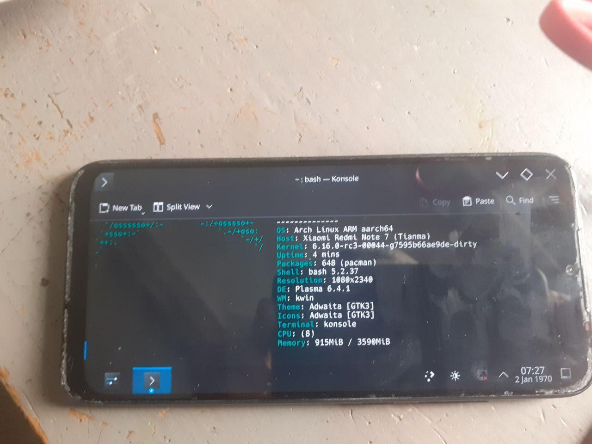

# Supported device list

| Symbol | Meaning      |
|:------:|:------------:|
| ✅     | Working     |
| ⚠️     | Working problematic |
| ❗⚠️   | Not Working Partial |
| ❌     | Not Working |
| ❔     | Unknown     |

<b><strong>Qualcomm Devices</strong></b>

 

<b><strong>Snapdragon 660 Devices</strong></b>

 

<b><strong>Xiaomi Devices</strong></b>

## Xiaomi Redmi Note 7 (lavender)

### Support Status

<table>
<td>

| Feature              | Description   | State |
|:---------------------|:--------------|:-----:|
| Internal Storage     |               | ✅    |
| Side Buttons         |               | ✅    |
| Proximity Sensor     |               | ❌    |
| Light Sensor         |               | ❌    |
| Accelerometer Sensor |               | ✅    |
| Compass Sensor       |               | ❌    | 
| Gyroscope Sensor     |               | ❌    |
| Fingerprint Sensor   |               | ❌    |
| NFC Sensor           |               | ❌    |
| Temperature Sensor   |               | ✅    |
| Battery              |               | ✅    |
| USB Host Mode        |               | ⚠️    |
| USB Device Mode      |               | ✅    |
| USB Power Delivery   |               | ❌    |
| Charging             |               | ✅    |
| WLAN                 |               | ⚠️    |
| CPU                  |               | ✅    |
| Touchscreen          |               | ✅    |
| Bluetooth            |               | ⚠️    |
| GPS                  |               | ❌    |
| Speakers             |               | ❌    |
| Microphone           |               | ❌    |
| GPU                  |               | ✅    |
| Camera               |               | ❌    |
| Flashlight           |               | ✅    |
| Mobile Data          |               | ❗⚠️  |
| Display              |               | ✅    | 
| Vibration            |               | ✅    |

</td>
</table>

 

 
